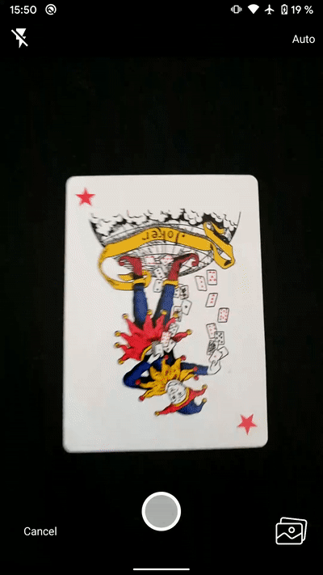

# Document Scanner with tiny OpenCV

    
    

**Document Scanner** is an Android library (kotlin based) for scanning documents based on [CameraX API](https://developer.android.com/training/camerax) and a tiny version of [OpenCV](https://opencv.org).

### Features
- tiny version of OpenCV 4.4.0:
	- armeabi-v7a: **3.1 MB** (original: 10.1 MB)
	- arm64-v8a: **5.6 MB** (original: 18.8 MB)
	- x86: **16.7 MB** (original: 38.6 MB)
	- x86_64: **25.1 MB** (original: 53.7 MB)
- live detection (also detect rectangle with one bent angle)
- auto scan and flash support
- edit detected rectangle
- configure size of results using [Compressor](https://github.com/zetbaitsu/Compressor)

## Getting started

**Document Scanner**  is supported on Android devices starting from **SDK 21 (Lollipop)** 

### Installation

in root project build.gradle:

	allprojects {
	    repositories {
		...
		maven { url "https://jitpack.io" }
	    }
	}
	
in app build.gradle:

	android {
	    ...
	    compileOptions {
		sourceCompatibility JavaVersion.VERSION_1_8
		targetCompatibility JavaVersion.VERSION_1_8
	    }
	}
	
	dependencies {
    	    ...
	    implementation 'com.github.zynkware:Document-Scanning-Android-SDK:1.1.1'
	}
	
### Usage

#### Initialization

In your Application class: 

    class MyCustomApplication: Application() {  
        override fun onCreate() {  
            ...
            val configuration = DocumentScanner.Configuration()  
	    	configuration.imageQuality = 100  
	    	configuration.imageSize = 1000000 // 1 MB  
	    	configuration.imageType = Bitmap.CompressFormat.JPEG  
	    	DocumentScanner.init(this, configuration) // or simply DocumentScanner.init(this)
        }   
    }

Create an Activity (e.g. AppScanActivity) that extends **ScanActivity**

In manifest:

    <activity android:name=".AppScanActivity"  
		      android:screenOrientation="portrait"  
		      android:theme="@style/Theme.AppCompat.NoActionBar" />

AppScanActivity:

    class AppScanActivity: ScanActivity() {  
	    override fun onCreate(savedInstanceState: Bundle?) {  
            super.onCreate(savedInstanceState)  
            setContentView(R.layout.app_scan_activity_layout)  
            addFragmentContentLayout()
        }  
      
        override fun onError(error: DocumentScannerErrorModel) {  
	        
        }
      
        override fun onSuccess(scannerResults: ScannerResults) {  
	        
        }
      
        override fun onClose() {  
            finish()  
        }

#### ScannerResults

Document Scanner library will return image files using `fun onSuccess(scannerResults: ScannerResults)`. ScannerResults contains 3 files:
- **originalImageFile** - image from camera (with Configuration declared in your Application class).
- **croppedImageFile** - cropped/document image
- **transformedImageFile** - croppedPhotoFile with grayscale filter or null if grayscale is not applied

#### Error Handling
All errors are returned to app using `fun onError(error: DocumentScannerErrorModel)`

    data class DocumentScannerErrorModel(  
	     var errorMessage: ErrorMessage? = null,  
	     var throwable: Throwable? = null  
    )
`ErrorMessage` is an enum containing the following error types:
- TAKE_IMAGE_FROM_GALLERY_ERROR
- PHOTO_CAPTURE_FAILED
- CAMERA_USE_CASE_BINDING_FAILED
- DETECT_LARGEST_QUADRILATERAL_FAILED
- INVALID_IMAGE
- CAMERA_PERMISSION_REFUSED_WITHOUT_NEVER_ASK_AGAIN
- CAMERA_PERMISSION_REFUSED_GO_TO_SETTINGS
- STORAGE_PERMISSION_REFUSED_WITHOUT_NEVER_ASK_AGAIN
- STORAGE_PERMISSION_REFUSED_GO_TO_SETTINGS
- CROPPING_FAILED

`Throwable` can be null for some error messages like Permissions 

## Configuration
* **imageQuality**:
	* From 0 to 100
	* Default value is 100
* **imageSize**:
	* Image size in bytes
	* No default value
* **imageType**:
	* imageType can be Bitmap.CompressFormat.JPEG, Bitmap.CompressFormat.PNG or Bitmap.CompressFormat.WEBP
	* Default value is Bitmap.CompressFormat.JPEG

## Thanks
* [OpenCV](https://opencv.org)
* [Compressor](https://github.com/zetbaitsu/Compressor)
* [kPermissions](https://github.com/fondesa/kpermissions)
* Inspiration from [mayuce](https://github.com/mayuce/AndroidDocumentScanner), [adityaarora1](https://github.com/adityaarora1/LiveEdgeDetection) and [hannesa2](https://github.com/hannesa2/LiveEdgeDetection)

## License

	Copyright 2020 ZynkSoftware SRL

	Permission is hereby granted, free of charge, to any person obtaining a copy of this software and
	associated documentation files (the "Software"), to deal in the Software without restriction,
	including without limitation the rights to use, copy, modify, merge, publish, distribute,
	sublicense, and/or sell copies of the Software, and to permit persons to whom the Software is
	furnished to do so, subject to the following conditions:

	The above copyright notice and this permission notice shall be included in all copies or
	substantial portions of the Software.

	THE SOFTWARE IS PROVIDED "AS IS", WITHOUT WARRANTY OF ANY KIND, EXPRESS OR IMPLIED,
	INCLUDING BUT NOT LIMITED TO THE WARRANTIES OF MERCHANTABILITY, FITNESS FOR A PARTICULAR PURPOSE AND
	NONINFRINGEMENT. IN NO EVENT SHALL THE AUTHORS OR COPYRIGHT HOLDERS BE LIABLE FOR ANY CLAIM,
	DAMAGES OR OTHER LIABILITY, WHETHER IN AN ACTION OF CONTRACT, TORT OR OTHERWISE, ARISING FROM,
	OUT OF OR IN CONNECTION WITH THE SOFTWARE OR THE USE OR OTHER DEALINGS IN THE SOFTWARE.
	

